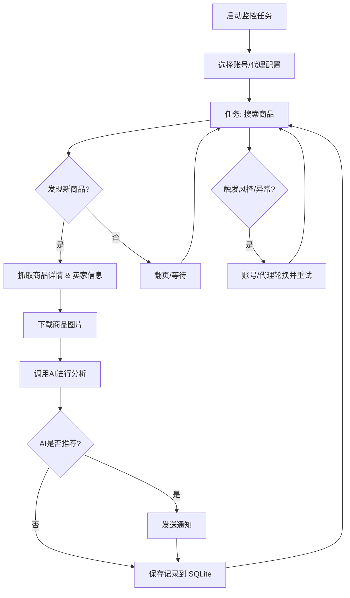

<div align="center">

# 闲鱼智能监控系统

**基于 Playwright 和 AI 的闲鱼多任务实时监控，提供完整的 Web 管理界面**

[](https://github.com/LemonYangZW/ai-goofish-monitor/actions/workflows/tests.yml)
[](LICENSE)
[](https://www.python.org/)

简体中文 ｜ [English](README_EN.md)

</div>

> [!NOTE]
> **关于本仓库**
>
> 上游项目 [Usagi-org/ai-goofish-monitor](https://github.com/Usagi-org/ai-goofish-monitor) 已于 2026 年 5 月归档，不再接受更新。
> 本仓库是其**社区续维分支**，在原有 MIT 许可下继续修复缺陷、跟进闲鱼页面与风控变更。
>
> 衷心感谢原作者 [@dingyufei615](https://github.com/dingyufei615)、[@rainsfly](https://github.com/rainsfly) 以及全体上游贡献者的工作。
>
> 变更记录见 [CHANGELOG.md](CHANGELOG.md)　·　维护约定见 [docs/MAINTAINING.md](docs/MAINTAINING.md)

## ✨ 核心特性

| 特性 | 说明 |
|------|------|
| **Web 可视化管理** | 任务管理、账号管理、AI 标准编辑、运行日志、结果浏览 |
| **AI 驱动** | 自然语言创建任务，多模态模型深度分析商品 |
| **多任务并发** | 独立配置关键词、价格、筛选条件和 AI Prompt |
| **高级筛选** | 包邮、新发布时间范围、省 / 市 / 区三级区域筛选 |
| **即时通知** | ntfy.sh、企业微信、Bark、Telegram、Webhook 等多渠道 |
| **定时调度** | 支持 Cron 表达式配置周期性任务 |
| **账号与代理轮换** | 多账号管理、任务绑定账号、代理池轮换与失败重试 |
| **Docker 部署** | 一键容器化部署，镜像内置 Chromium |

<details>
<summary><b>📸 界面预览</b>（点击展开）</summary>

<br>


</details>

<br>

# 快速上手

## 🚀 部署方式

### Docker 部署（推荐）

```bash
git clone https://github.com/LemonYangZW/ai-goofish-monitor && cd ai-goofish-monitor
cp .env.example .env
vim .env          # 填写下方「最少配置」中的必填项
docker compose up -d
docker compose logs -f app
```

| 项目 | 说明 |
|------|------|
| Web UI | `http://127.0.0.1:8000` |
| 浏览器 | 镜像已内置 Chromium，宿主机无需额外安装 |
| 更新 | `docker compose pull && docker compose up -d` |
| 端口 | 若修改 `.env` 的 `SERVER_PORT`，需同步 `docker-compose.yaml` 的端口映射 |

> [!IMPORTANT]
> `docker-compose.yaml` 默认镜像仍为上游归档版本 `ghcr.io/usagi-org/ai-goofish:latest`，**不包含本仓库的修复**。
> 本仓库镜像发布后，可通过环境变量切换：
>
> ```bash
> APP_IMAGE=ghcr.io/lemonyangzw/ai-goofish:latest docker compose up -d
> ```

<details>
<summary>镜像拉取缓慢时的加速方案</summary>

<br>

```bash
docker pull ghcr.nju.edu.cn/usagi-org/ai-goofish:latest
docker tag  ghcr.nju.edu.cn/usagi-org/ai-goofish:latest ghcr.io/usagi-org/ai-goofish:latest
docker compose up -d
```

</details>

### 本地运行

**环境要求**

- Python 3.10+
- Node.js + npm（前端构建，已验证 `Node v20.18.3`）
- Playwright CLI 与 Chromium：`python3 -m pip install playwright && python3 -m playwright install chromium`
- Chrome / Edge 浏览器（Linux 下 Chromium 亦可）

```bash
git clone https://github.com/LemonYangZW/ai-goofish-monitor
cd ai-goofish-monitor
cp .env.example .env

./start.sh        # Linux / macOS，首次需 chmod +x start.sh
start.bat         # Windows
```

启动脚本会检查前置条件，随后安装依赖、构建前端并启动后端。

## ⚙️ 最少配置

| 变量 | 说明 | 必填 |
|------|------|:----:|
| `OPENAI_API_KEY` | AI 模型 API Key | ✅ |
| `OPENAI_BASE_URL` | OpenAI 兼容接口地址 | ✅ |
| `OPENAI_MODEL_NAME` | **支持图片输入**的模型名称 | ✅ |
| `WEB_USERNAME` / `WEB_PASSWORD` | Web UI 登录凭据，默认 `admin/admin123` | — |

> [!WARNING]
> 生产环境请务必修改默认的 Web 登录密码。

完整配置项见下方「配置说明」章节与 `.env.example`。

## 🎬 第一次使用

1. 打开 `http://127.0.0.1:8000` 并登录
2. 进入「闲鱼账号管理」，使用 [Chrome 扩展](https://chromewebstore.google.com/detail/xianyu-login-state-extrac/eidlpfjiodpigmfcahkmlenhppfklcoa) 导出并粘贴闲鱼登录态 JSON
3. 登录态会保存至 `state/` 目录，例如 `state/acc_1.json`
4. 回到「任务管理」，创建任务并绑定账号后即可运行

创建任务时的三种模式：

| 模式 | 行为 |
|------|------|
| **AI 判断** | 填写「详细需求」，提交后弹出独立进度窗口，后台异步生成分析标准 |
| **关键词判断** | 填写关键词规则，任务直接创建，不经过 AI 生成流程 |
| **区域筛选** | 省 / 市 / 区三级选择器，会显著缩小结果集，首次使用建议留空 |

<br>

# 使用参考

## ⚙️ 配置说明

<details>
<summary>常用配置项一览</summary>

<br>

**AI 与运行时**

| 变量 | 说明 |
|------|------|
| `OPENAI_API_KEY` / `OPENAI_BASE_URL` / `OPENAI_MODEL_NAME` | AI 模型接入必填项 |
| `PROXY_URL` | 为 AI 请求单独指定 HTTP / SOCKS5 代理 |
| `RUN_HEADLESS` | 是否以无头模式运行爬虫，Docker 中应保持 `true` |
| `SERVER_PORT` | 后端监听端口，默认 `8000` |
| `LOGIN_IS_EDGE` | 本地可切换 Edge 内核；Docker 镜像未内置 Edge，容器内固定使用 Chromium |
| `PCURL_TO_MOBILE` | 是否将 PC 商品链接转换为移动端链接 |

**通知渠道**

`NTFY_TOPIC_URL`　`GOTIFY_URL` / `GOTIFY_TOKEN`　`BARK_URL`　`WX_BOT_URL`
`TELEGRAM_BOT_TOKEN` / `TELEGRAM_CHAT_ID` / `TELEGRAM_API_BASE_URL`　`WEBHOOK_*`

**代理轮换与失败保护**

`PROXY_ROTATION_ENABLED`　`PROXY_ROTATION_MODE`　`PROXY_POOL`
`PROXY_ROTATION_RETRY_LIMIT`　`PROXY_BLACKLIST_TTL`
`TASK_FAILURE_THRESHOLD`　`TASK_FAILURE_PAUSE_SECONDS`　`TASK_FAILURE_GUARD_PATH`

完整示例见 `.env.example`。

</details>

## 💾 数据存储与迁移

<details>
<summary>存储结构与迁移说明</summary>

<br>

- 在线主存储为 SQLite，默认路径 `data/app.sqlite3`
- 可通过 `APP_DATABASE_FILE` 自定义路径；Docker 中默认为 `/app/data/app.sqlite3`
- 应用启动时自动建库建表，并尝试从旧的 `config.json`、`jsonl/`、`price_history/` 导入一次历史数据
- `state/`、`prompts/`、`logs/`、`images/` 仍为文件系统目录，不在 SQLite 中
- 商品图片临时存放于 `images/task_images_<task_name>/`，任务结束后默认清理

**Docker 默认持久化目录**

| 目录 | 用途 |
|------|------|
| `data/` | SQLite 主存储（任务、结果、价格历史） |
| `state/` | 登录态 cookie 文件 |
| `prompts/` | 任务提示词 |
| `logs/` | 运行日志 |
| `images/` | 商品图片与任务临时目录 |
| `config.json`、`jsonl/`、`price_history/` | 首次升级到 SQLite 时的兼容导入源 |

确认 `data/app.sqlite3` 数据无误后，可自行决定是否继续保留旧数据源的挂载。

</details>

## 📖 功能说明

<details>
<summary>Web UI 各模块用法</summary>

<br>

**任务管理**

- 支持 AI 创建、关键词规则、价格范围、新发布范围、区域筛选、账号绑定、定时规则
- AI 任务创建为后台 job 流程，提交后打开独立进度窗口
- 区域筛选会显著缩小结果集，默认留空

**账号管理**

- 支持导入、更新、删除闲鱼账号登录态
- 每个任务可指定账号，也可不绑定交由系统自动选择

**结果查看与运行日志**

- 结果页与导出功能从 SQLite 查询，不再扫描 `jsonl` 文件
- 日志页按任务展示运行过程，便于排查登录态失效、风控与 AI 调用问题

**系统设置**

- 查看系统状态、编辑 Prompt、调整代理与轮换配置

**Web 界面认证**

- Web UI 通过登录页收集账号密码，由 `POST /auth/status` 校验
- 登录成功后前端在浏览器本地保存登录态，用于路由守卫与 WebSocket 初始化
- 默认凭据 `admin/admin123`，生产环境请务必修改

</details>

## 🔄 工作流程

单个监控任务从启动到完成的核心逻辑。主服务运行于 `src.app`，按用户操作或定时调度启动任务进程。



## ❓ 常见问题

<details>
<summary>AI 任务创建为什么不是立即完成？</summary>

<br>

AI 模式会先生成分析标准再创建任务。该流程为后台 job，提交后显示独立进度窗口，避免表单长时间卡住。

</details>

<details>
<summary>区域筛选为什么建议默认留空？</summary>

<br>

区域筛选会显著减少搜索结果，适合明确只看某个区域的场景。若要先验证整体市场，建议先不填。

</details>

<details>
<summary>页面提示前端构建产物不存在？</summary>

<br>

说明根目录 `dist/` 缺失。执行 `./start.sh`，或先在 `web-ui/` 执行 `npm run build` 并确认产物已复制到仓库根目录。

</details>

<details>
<summary>启动脚本提示缺少 Playwright 或浏览器？</summary>

<br>

这是脚本的前置检查。请先安装 Playwright CLI 与 Chromium，并确保系统中有可用的 Chrome / Edge，然后重新执行。

</details>

<details>
<summary>修改 AI 提示词后需要重启服务吗？</summary>

<br>

不需要。爬虫在每次任务启动时从磁盘重新读取 `prompts/` 下的文件并组装，没有缓存。但正在运行中的任务不受影响，需等下一轮。

</details>

<details>
<summary>日志报「登录态失效」，更新 Cookie 后仍然失败？</summary>

<br>

该判定是启发式的，触发条件为「搜索页零 mtop 响应且页面渲染为首页」。除 Cookie 过期外，页面资源加载失败、风控拦截、网络异常都会命中同一条件。

请查看日志中的「资源加载失败」计数：**若不为 0，应优先排查请求头与代理配置**，而非反复更新登录态。

</details>

<br>

# 开发与维护

## 🛠 开发指南

<details>
<summary>本地开发、爬虫命令与测试</summary>

<br>

**手动启动**

```bash
# 后端
python -m src.app
# 或
uvicorn src.app:app --host 0.0.0.0 --port 8000 --reload

# 前端
cd web-ui && npm install && npm run dev
```

- FastAPI 启动时自动初始化 SQLite，并在首次启动时尝试导入旧数据
- `spider_v2.py` 默认从 SQLite 读取任务；仅当显式传入 `--config <path>` 时才走 JSON 兼容模式
- Vite 开发服务器将 `/api`、`/auth`、`/ws` 代理到 `http://127.0.0.1:8000`
- `npm run build` 生成 `web-ui/dist/`，启动脚本再复制到仓库根目录 `dist/`
- FastAPI 负责提供根目录 `dist/index.html` 与 `dist/assets/`

**爬虫命令**

```bash
python spider_v2.py                          # 运行所有启用任务
python spider_v2.py --task-name "MacBook"    # 运行指定任务
python spider_v2.py --debug-limit 3          # 调试模式，限制商品数
```

> [!TIP]
> 调试模式结束时会等待回车关闭浏览器。在无终端环境（后台、CI）下运行需用 `echo | python spider_v2.py ...` 喂入输入。

**测试与校验**

```bash
pytest -m "not live and not live_slow"       # 与 CI 一致
coverage run -m pytest -m "not live and not live_slow" && coverage report
cd web-ui && npm run build
```

`live` / `live_slow` 用例需要真实闲鱼登录态与 AI 凭据，仅在本地手动执行。

**任务创建 API**

| 端点 | 行为 |
|------|------|
| `POST /api/tasks/generate` | `decision_mode=ai` 返回 `202` 与 `job`，需继续轮询；`decision_mode=keyword` 直接返回已创建任务 |
| `GET /api/tasks/generate-jobs/{job_id}` | 查询 AI 任务生成进度 |
| `POST /auth/status` | 校验 Web UI 登录凭据 |

</details>

## 🤝 维护与贡献

- 变更记录：[CHANGELOG.md](CHANGELOG.md)
- 维护约定（分支模型、上游同步、版本与发布流程）：[docs/MAINTAINING.md](docs/MAINTAINING.md)
- 欢迎通过 Issue 反馈问题，或提交 PR。合入前请确保 `Tests` workflow 通过。

## 🙏 致谢

<details>
<summary>参考项目与社区</summary>

<br>

本项目在开发过程中参考了以下优秀项目，特此感谢：

- [superboyyy/xianyu_spider](https://github.com/superboyyy/xianyu_spider)

感谢 LinuxDo 相关人员的脚本贡献：

- [@jooooody](https://linux.do/u/jooooody/summary)

以及感谢 [LinuxDo](https://linux.do/) 社区。

感谢 ClaudeCode / Gemini / Codex 等模型工具，解放双手，体验 Vibe Coding 的快乐。

</details>

## ⚠️ 注意事项

> [!CAUTION]
> 本项目仅供学习和技术研究使用，请勿用于非法用途。

- 请遵守闲鱼的用户协议和 robots.txt 规则，不要进行过于频繁的请求，以免对服务器造成负担或导致账号被限制
- 本项目采用 [MIT 许可证](LICENSE) 发布，按「现状」提供，不提供任何形式的担保
- 项目作者及贡献者不对因使用本软件而导致的任何直接、间接、附带或特殊的损害或损失承担责任
- 详细信息请查看[免责声明](DISCLAIMER.md)

## ⭐ Star History

下图为上游项目的 Star 历史，记录了这个项目所积累的社区认可：

[](https://www.star-history.com/#Usagi-org/ai-goofish-monitor&Date)


