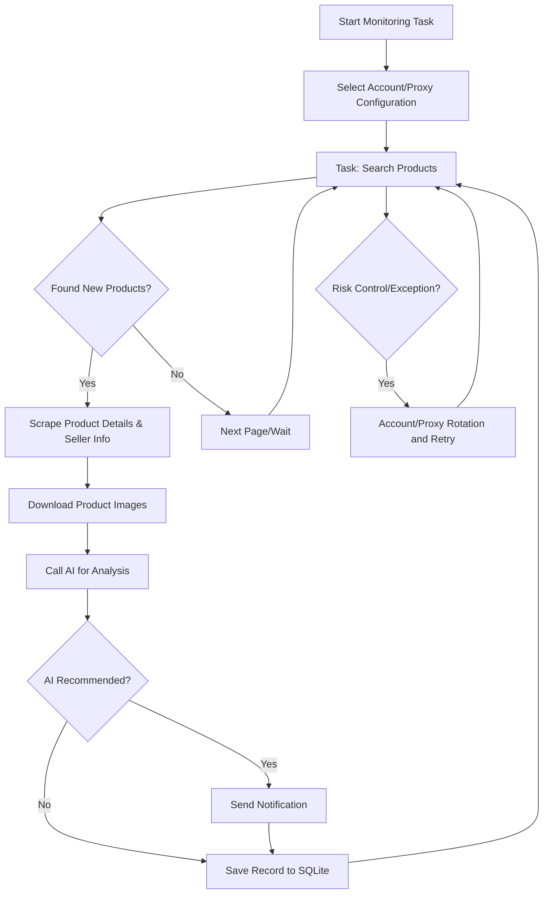

<div align="center">

# Xianyu Intelligent Monitor Bot

**A Playwright and AI-powered multi-task real-time monitoring tool for Xianyu (闲鱼), with a complete web management interface**

[](https://github.com/LemonYangZW/ai-goofish-monitor/actions/workflows/tests.yml)
[](LICENSE)
[](https://www.python.org/)

[简体中文](README.md) ｜ English

</div>

> [!NOTE]
> **About this repository**
>
> The upstream project [Usagi-org/ai-goofish-monitor](https://github.com/Usagi-org/ai-goofish-monitor) was archived in May 2026 and no longer accepts updates.
> This repository is a **community-maintained continuation**, carrying on bug fixes and adapting to Xianyu's page and anti-bot changes under the original MIT license.
>
> Sincere thanks to the original authors [@dingyufei615](https://github.com/dingyufei615), [@rainsfly](https://github.com/rainsfly), and all upstream contributors.
>
> Changes are tracked in [CHANGELOG.md](CHANGELOG.md)　·　maintenance conventions in [docs/MAINTAINING.md](docs/MAINTAINING.md)

## ✨ Core Features

| Feature | Description |
|---------|-------------|
| **Web Visual Management** | Task management, account management, AI criteria editing, run logs, results browsing |
| **AI-Driven** | Natural language task creation, multimodal model for in-depth product analysis |
| **Multi-Task Concurrency** | Independent configuration for keywords, prices, filters, and AI prompts |
| **SQLite Primary Storage** | Tasks, results, and price history persisted in one embedded database |
| **Advanced Filtering** | Free shipping, new listing time range, province / city / district filtering |
| **Instant Notifications** | ntfy.sh, WeChat Work, Bark, Telegram, Webhook |
| **Scheduled Tasks** | Cron expression configuration for periodic tasks |
| **Account & Proxy Rotation** | Multi-account management, task-account binding, proxy pool rotation with retry |
| **Docker Deployment** | One-click containerized deployment with bundled Chromium |

<details>
<summary><b>📸 Screenshots</b> (click to expand)</summary>

<br>


</details>

<br>

# Getting Started

## 🚀 Deployment

### Docker (Recommended)

```bash
git clone https://github.com/LemonYangZW/ai-goofish-monitor && cd ai-goofish-monitor
cp .env.example .env
vim .env          # fill in the required values listed under "Minimum Configuration"
docker compose up -d
docker compose logs -f app
```

| Item | Details |
|------|---------|
| Web UI | `http://127.0.0.1:8000` |
| Browser | Chromium is bundled in the image; no host install required |
| Update | `docker compose pull && docker compose up -d` |
| Ports | If you change `SERVER_PORT` in `.env`, update the `ports` mapping in `docker-compose.yaml` too |

> [!IMPORTANT]
> The default image in `docker-compose.yaml` is still the upstream archived build `ghcr.io/usagi-org/ai-goofish:latest`, which **does not include the fixes from this repository**.
> Once this repository publishes its own image, switch with an environment variable:
>
> ```bash
> APP_IMAGE=ghcr.io/lemonyangzw/ai-goofish:latest docker compose up -d
> ```

<details>
<summary>Mirror acceleration for slow pulls</summary>

<br>

```bash
docker pull ghcr.nju.edu.cn/usagi-org/ai-goofish:latest
docker tag  ghcr.nju.edu.cn/usagi-org/ai-goofish:latest ghcr.io/usagi-org/ai-goofish:latest
docker compose up -d
```

</details>

### Local Setup

**Requirements**

- Python 3.10+
- Node.js + npm (frontend build, verified with `Node v20.18.3`)
- Playwright CLI and Chromium: `python3 -m pip install playwright && python3 -m playwright install chromium`
- Chrome / Edge browser (Chromium also works on Linux)

```bash
git clone https://github.com/LemonYangZW/ai-goofish-monitor
cd ai-goofish-monitor
cp .env.example .env

./start.sh        # Linux / macOS, run chmod +x start.sh first
start.bat         # Windows
```

The startup script validates prerequisites, then installs dependencies, builds the frontend, and starts the backend.

## ⚙️ Minimum Configuration

| Variable | Description | Required |
|----------|-------------|:--------:|
| `OPENAI_API_KEY` | AI model API key | ✅ |
| `OPENAI_BASE_URL` | OpenAI-compatible API base URL | ✅ |
| `OPENAI_MODEL_NAME` | Model name **with image input support** | ✅ |
| `WEB_USERNAME` / `WEB_PASSWORD` | Web UI credentials, default `admin/admin123` | — |

> [!WARNING]
> Always change the default Web UI password in production.

See the "Configuration" section below and `.env.example` for the full list.

## 🎬 First-Time Setup

1. Open `http://127.0.0.1:8000` and sign in
2. Go to "Xianyu Account Management" and use the [Chrome Extension](https://chromewebstore.google.com/detail/xianyu-login-state-extrac/eidlpfjiodpigmfcahkmlenhppfklcoa) to export and paste the Xianyu login-state JSON
3. Login-state files are stored in `state/`, for example `state/acc_1.json`
4. Go back to "Task Management", create a task, bind an account, and run it

Three task modes:

| Mode | Behavior |
|------|----------|
| **AI mode** | Fill in the requirement description; submission opens a separate progress dialog while criteria are generated asynchronously |
| **Keyword mode** | Provide keyword rules and the task is created immediately, bypassing AI generation |
| **Region filter** | Province / city / district selector; sharply reduces results, leave empty on first run |

<br>

# Reference

## ⚙️ Configuration

<details>
<summary>Common configuration items</summary>

<br>

**AI and Runtime**

| Variable | Description |
|----------|-------------|
| `OPENAI_API_KEY` / `OPENAI_BASE_URL` / `OPENAI_MODEL_NAME` | Required AI model settings |
| `PROXY_URL` | Dedicated HTTP / SOCKS5 proxy for AI requests |
| `RUN_HEADLESS` | Whether the scraper runs headless; keep `true` in Docker |
| `SERVER_PORT` | Backend port, default `8000` |
| `LOGIN_IS_EDGE` | Use Edge locally; Docker images do not bundle Edge and always run Chromium |
| `PCURL_TO_MOBILE` | Convert desktop item URLs to mobile URLs |

**Notification Channels**

`NTFY_TOPIC_URL`　`GOTIFY_URL` / `GOTIFY_TOKEN`　`BARK_URL`　`WX_BOT_URL`
`TELEGRAM_BOT_TOKEN` / `TELEGRAM_CHAT_ID` / `TELEGRAM_API_BASE_URL`　`WEBHOOK_*`

**Proxy Rotation and Failure Guard**

`PROXY_ROTATION_ENABLED`　`PROXY_ROTATION_MODE`　`PROXY_POOL`
`PROXY_ROTATION_RETRY_LIMIT`　`PROXY_BLACKLIST_TTL`
`TASK_FAILURE_THRESHOLD`　`TASK_FAILURE_PAUSE_SECONDS`　`TASK_FAILURE_GUARD_PATH`

See `.env.example` for the full list.

</details>

## 💾 Storage and Migration

<details>
<summary>Storage layout and migration notes</summary>

<br>

- SQLite is the online primary storage, default path `data/app.sqlite3`
- Override the path with `APP_DATABASE_FILE`; Docker sets it to `/app/data/app.sqlite3`
- On startup the app initializes the schema and imports existing data once from legacy `config.json`, `jsonl/`, and `price_history/`
- `state/`, `prompts/`, `logs/`, and `images/` remain filesystem-based and are not stored in SQLite
- Product images are temporarily downloaded to `images/task_images_<task_name>/` and cleaned up when the task finishes

**Docker persisted directories**

| Directory | Purpose |
|-----------|---------|
| `data/` | SQLite primary store (tasks, results, price history) |
| `state/` | Login-state cookie files |
| `prompts/` | Task prompt files |
| `logs/` | Runtime logs |
| `images/` | Product images and per-task temporary folders |
| `config.json`, `jsonl/`, `price_history/` | Legacy sources for the first SQLite migration |

After verifying the contents of `data/app.sqlite3`, you can decide whether to keep the legacy mounts.

</details>

## 📖 Feature Guide

<details>
<summary>Web UI usage notes</summary>

<br>

**Task Management**

- Supports AI creation, keyword rules, price range, new listing filters, region filters, account binding, and cron scheduling
- AI task creation runs as a background job with a dedicated progress dialog
- Region filtering greatly reduces results, so leaving it empty is the safer default

**Account Management**

- Import, update, and delete Xianyu login states
- Each task can bind a specific account or leave selection to the system

**Results and Logs**

- The results page and export endpoints query SQLite instead of scanning `jsonl` files
- The logs page is the first place to inspect login-state expiry, anti-bot issues, or AI call failures

**System Settings**

- View system status, edit prompts, and adjust proxy / rotation settings

**Web Authentication**

- The Web UI collects credentials on a login page, validated through `POST /auth/status`
- After login the frontend stores auth state locally for route guards and WebSocket startup
- Default credentials are `admin/admin123`; change them in production

</details>

## 🔄 Workflow

Core processing flow of a single monitoring task. The main service runs in `src.app` and launches task processes based on user actions or schedule triggers.



## ❓ FAQ

<details>
<summary>Why does AI task creation take time?</summary>

<br>

In AI mode the system generates analysis criteria before creating the task. This runs as a background job with a separate progress dialog instead of blocking the form.

</details>

<details>
<summary>Why is the region filter optional by default?</summary>

<br>

Region filtering sharply reduces result volume. Leave it empty if you want a broader market scan first.

</details>

<details>
<summary>Why does the app say the frontend build artifacts are missing?</summary>

<br>

The repository root `dist/` directory is missing. Run `./start.sh`, or build the frontend in `web-ui/` and make sure artifacts are copied to the root `dist/`.

</details>

<details>
<summary>Why does the startup script complain about missing Playwright or a browser?</summary>

<br>

That is the prerequisite check. Install the Playwright CLI and Chromium first, make sure Chrome / Edge / Chromium is available, then rerun.

</details>

<details>
<summary>Do I need to restart the service after editing AI prompts?</summary>

<br>

No. The scraper re-reads files under `prompts/` from disk on every task start, with no caching. A task already running is unaffected and picks up changes on the next round.

</details>

<details>
<summary>Logs report "login state expired" but updating cookies does not help?</summary>

<br>

That verdict is heuristic — it triggers on "zero mtop responses on the search page while the page renders as the homepage". Besides expired cookies, failed resource loading, anti-bot interception, and network errors all match the same condition.

Check the "resource load failure" count in the log: **if it is non-zero, investigate request headers and proxy configuration first** rather than repeatedly refreshing the login state.

</details>

<br>

# Development & Maintenance

## 🛠 Developer Guide

<details>
<summary>Local development, scraper commands, and testing</summary>

<br>

**Manual Start**

```bash
# backend
python -m src.app
# or
uvicorn src.app:app --host 0.0.0.0 --port 8000 --reload

# frontend
cd web-ui && npm install && npm run dev
```

- FastAPI initializes SQLite on startup and performs the one-time legacy import when needed
- `spider_v2.py` loads tasks from SQLite by default; JSON config is used only when `--config <path>` is passed explicitly
- The Vite dev server proxies `/api`, `/auth`, and `/ws` to `http://127.0.0.1:8000`
- `npm run build` writes `web-ui/dist/`, and the startup script copies it to the repository root `dist/`
- FastAPI serves `dist/index.html` and `dist/assets/` from the repository root

**Scraper Commands**

```bash
python spider_v2.py                          # run all enabled tasks
python spider_v2.py --task-name "MacBook"    # run a specific task
python spider_v2.py --debug-limit 3          # debug mode, limit item count
```

> [!TIP]
> Debug mode waits for Enter before closing the browser. In a non-interactive environment (background, CI), pipe input with `echo | python spider_v2.py ...`.

**Testing and Validation**

```bash
pytest -m "not live and not live_slow"       # same as CI
coverage run -m pytest -m "not live and not live_slow" && coverage report
cd web-ui && npm run build
```

`live` / `live_slow` cases require real Xianyu login state and AI credentials, and are only run manually.

**Task Creation API**

| Endpoint | Behavior |
|----------|----------|
| `POST /api/tasks/generate` | `decision_mode=ai` returns `202` with a `job` to poll; `decision_mode=keyword` returns the created task directly |
| `GET /api/tasks/generate-jobs/{job_id}` | Fetch AI task-generation progress |
| `POST /auth/status` | Validate Web UI credentials |

</details>

## 🤝 Maintenance & Contributing

- Change log: [CHANGELOG.md](CHANGELOG.md)
- Maintenance conventions (branching model, upstream sync, versioning and release): [docs/MAINTAINING.md](docs/MAINTAINING.md)
- Issues and pull requests are welcome. Please make sure the `Tests` workflow passes before merging.

## 🙏 Acknowledgments

<details>
<summary>Referenced projects and community</summary>

<br>

This project referenced the following excellent projects during development. Special thanks to:

- [superboyyy/xianyu_spider](https://github.com/superboyyy/xianyu_spider)

Also thanks to LinuxDo contributors for script contributions:

- [@jooooody](https://linux.do/u/jooooody/summary)

And thanks to the [LinuxDo](https://linux.do/) community.

Also thanks to ClaudeCode / Gemini / Codex and other model tools for freeing our hands and bringing the joy of Vibe Coding.

</details>

## ⚠️ Notices

> [!CAUTION]
> This project is for learning and technical research purposes only. Do not use it for illegal purposes.

- Please comply with Xianyu's user agreement and robots.txt rules. Avoid frequent requests that may burden the server or get your account restricted
- Released under the [MIT License](LICENSE), provided "as is", without warranty of any kind
- The authors and contributors are not liable for any direct, indirect, incidental, or special damages arising from the use of this software
- See the [Disclaimer](DISCLAIMER.md) for details

## ⭐ Star History

The chart below shows the upstream project's star history, reflecting the community recognition it earned:

[](https://www.star-history.com/#Usagi-org/ai-goofish-monitor&Date)


